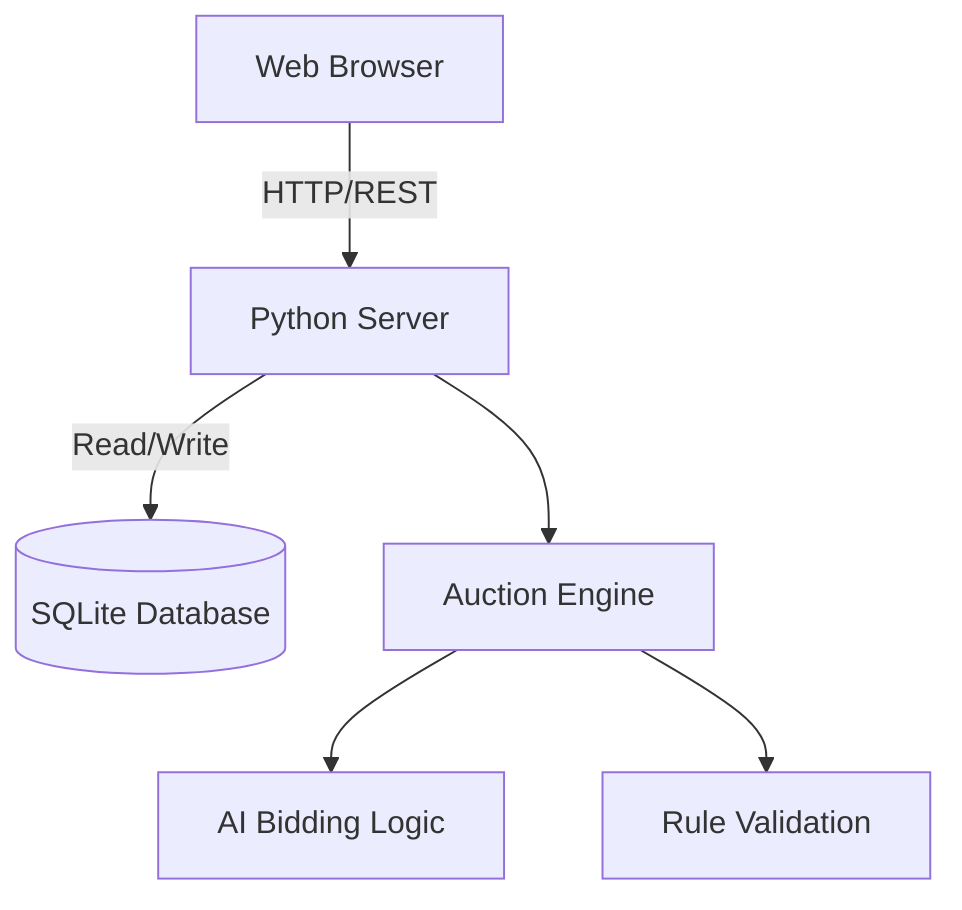

# 🏏 IPL Auction Game

Welcome to the **IPL Auction Game**, a web-based simulation where you can experience the thrill of the IPL auction table!

## 📸 Screenshots
*(Coming soon)*
> Place your game screenshot here.

## ✨ Features
- **Real Player Data**: Over 80 real IPL players with authentic stats and categories.
- **Bidding Simulation**: Real-time bidding engine with an intuitive interface.
- **Squad Building**: Build your dream team within a limited budget (Purse).
- **Player Stats & Ratings**: Players have custom ratings from 3.0 to 10.0.

## 🛠️ Tech Stack
- **Backend**: Python, SQLite, (FastAPI/Flask placeholder)
- **Frontend**: HTML, CSS, JavaScript (Vanilla or React - depending on the server)
- **Database**: SQLite3 (`ipl_auction.db`)

## 🚀 How to Run

1. Clone or navigate to the project directory:
   ```bash
   cd ipl-auction-game
   ```
2. Install the necessary requirements:
   ```bash
   pip install -r requirements.txt
   ```
3. Seed the player database:
   ```bash
   python seed_data.py
   ```
4. Start the server:
   ```bash
   python server.py
   ```
5. Open your browser and go to `http://localhost:8000`

## 🎮 How to Play
1. You start with a fixed purse (e.g., ₹100 Crores).
2. Players appear one by one on the auction table.
3. You can choose to place a bid or skip.
4. Other AI teams will compete with you for the players.
5. Highest bidder signs the player!
6. Form a squad of minimum 15 players with a max of 4 overseas players.

## 📊 Scoring System
Players are rated based on their past performances, role, and current demand:
- **Rating 8.5-10**: Elite/Marquee players, expect bidding wars up to ₹15-20 Cr.
- **Rating 7-8.5**: Solid starters, bids usually between ₹5-12 Cr.
- **Rating 5-7**: Role players, backup options. ₹1-5 Cr.
- **Rating 3-5**: Budget options and uncapped players. Base price to ₹1 Cr.

## 🏗️ Architecture Diagram



## 📖 API Documentation
| Endpoint | Method | Description |
|----------|--------|-------------|
| `/api/players` | GET | List all available players |
| `/api/player/:id` | GET | Get specific player details |
| `/api/bid` | POST | Submit a bid for a player |
| `/api/squad` | GET | View current squad and remaining purse |

## 📝 License
This project is licensed under the MIT License.
