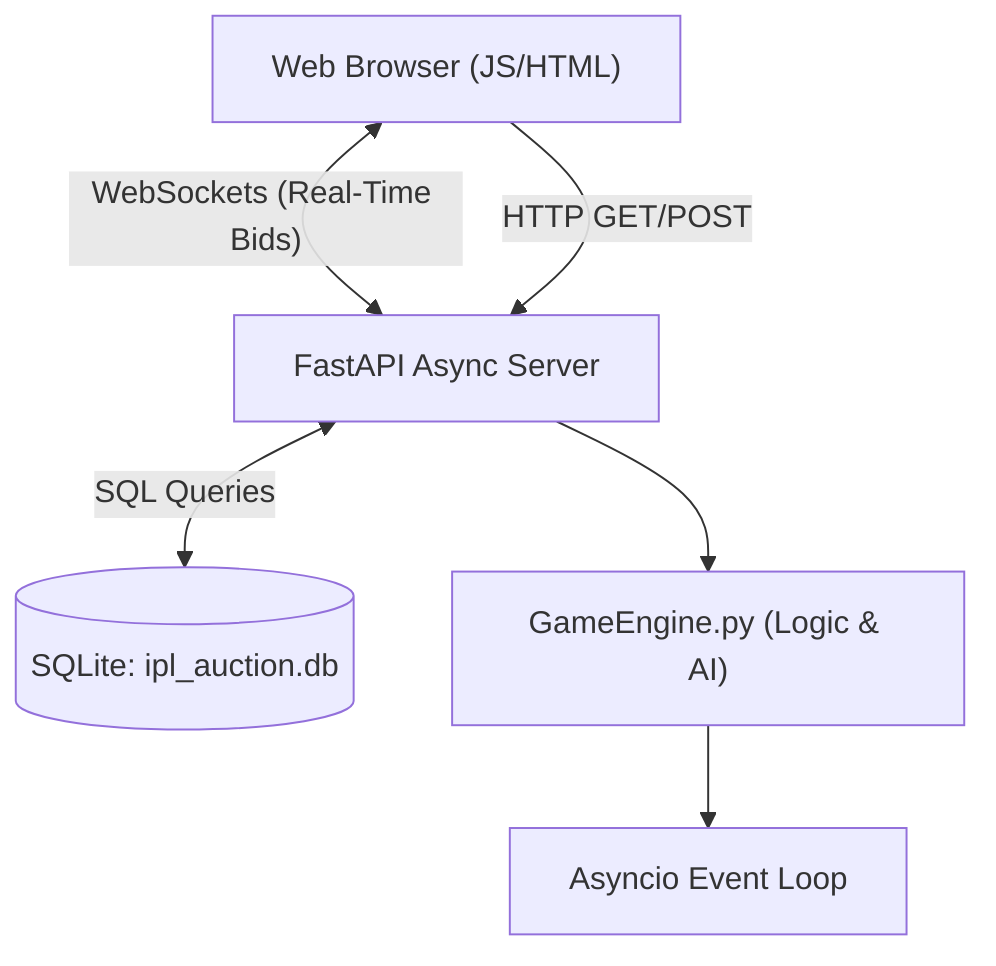

# 🏏 T20 Auction Simulator (Multiplayer)

Welcome to the **T20 Auction Simulator**, a real-time, highly interactive, multiplayer web-based game where you and your friends compete as billionaire franchise owners to build the ultimate cricket squad.

Built with **FastAPI**, **WebSockets**, and **Vanilla JS**, this simulator goes far beyond standard fantasy cricket. It features an advanced AI evaluator, strict squad composition rules, and intense psychological gamification (like panic timers, bidding war lightning, and live emoji trash talk) to make your auction room as chaotic and realistic as possible!


## 🌍 Live Demo & Access

You can play the game live on our server! 
**Website Link / IP Address:** `http://YOUR_IP_ADDRESS_HERE` *(Replace with actual live link/IP)*

## ✨ Key Features

- **🌐 Real-Time Multiplayer Bidding:** Join a room with up to 20 friends via WebSockets. Bids update instantly across all devices.
- **📈 Massive Authentic Database:** Over 550 real T20 players with actual historical statistics (Runs, Wickets, Strike Rate, Economy) powered by Cricsheet data.
- **🧠 AI Squad Evaluator:** At the end of the 15-round draft, a custom AI mathematically grades your team out of **10.0**. There is no arguing—the AI decides who drafted the best team based on raw stats.
- **🎯 Strict Franchise Rules:** To get a perfect score, you must balance a ₹120.00 CR budget and draft exactly:
  - **5 Batsmen** (Avg Strike Rate >= 137.0)
  - **5 Bowlers** (Avg Economy <= 7.70)
  - **3 All-Rounders**
  - **2 Wicket-Keepers**
  - **Max 6 Overseas Players**
- **🕵️ Secret Missions:** Every player is secretly assigned a "Secret Captain" to draft. Fail to buy them, and you suffer a massive point penalty!
- **⚡ Gamified Interactive UI:**
  - **Heartbeat Panic Timer:** When the clock hits 5 seconds, the screen flashes red and a heartbeat monitor plays.
  - **Bid War Lightning:** Fast bidding triggers a blue lightning overlay on the screen.
  - **Live Emojis:** Spam 😂, 🤡, 🤬, and 🔥 across everyone's screens in real-time.
  - **The Shredder:** Unsold players are literally ripped in half and shredded on screen with sound effects.
  - **Leader Crown:** The highest bidder gets a glowing 👑 next to their name.

## 🛠️ Tech Stack

- **Backend:** Python 3.10+, FastAPI, Uvicorn, WebSockets
- **Frontend:** HTML5, CSS3, Vanilla JavaScript (Single Page Application)
- **Database:** SQLite3
- **Deployment:** Docker

## 🚀 How to Run (Docker)

The absolute easiest way to run the game and make it accessible to your friends on your local network or server is using Docker.

1. **Clone the repository:**
   ```bash
   git clone https://github.com/Aditya27749/ipl-auction-game.git
   cd ipl-auction-game
   ```

2. **Build and Run the Docker Container:**
   ```bash
   sudo docker build -t ipl-game .
   sudo docker run -d -p 80:7860 --restart unless-stopped ipl-game
   ```

3. **Play the Game:**
   Open your browser and navigate to `http://localhost` (or your server's IP address).

## 📊 Scoring & Penalties

The AI engine is brutal. If you do not draft intelligently, your final score will plummet:
- **Overseas Penalty:** -0.5 points for every overseas player above the limit of 6.
- **Strike Rate Penalty:** -2.0 points if your team's average Batting SR drops below 137.0.
- **Economy Penalty:** -2.0 points if your team's average Bowling Econ goes above 7.70.
- **Secret Mission Failed:** -0.5 points if you do not successfully buy your secretly assigned target.
- **Tiebreakers:** Ties are broken by Total Squad Runs, then Total Squad Wickets.

## 🏗️ Architecture Overview



## 💰 Monetization Ready
The frontend is already configured with an SEO-friendly content wrapper, Legal Boilerplate pages (Privacy Policy, Terms of Service), and is highly optimized for **Monetag** In-Page Push or Vignette ad networks. 

## 📝 License
This project is for educational and simulation purposes. Not affiliated with any official cricket boards (BCCI, IPL, etc.). All player statistics are factual public domain data.
